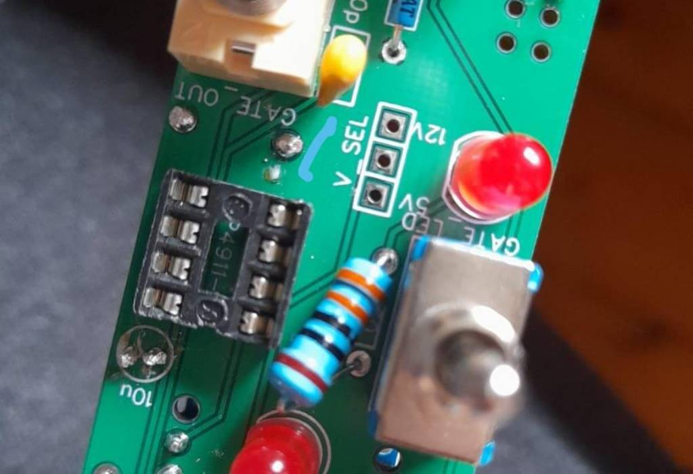

# HAGIWO 005 Eurorack Generative Sequencer Module

Through hole PCB version of the [HAGIWO 005 Generative Sequencer](https://www.youtube.com/watch?v=S4yxVxi9Iak) Eurorack module.
The module is a very simple Arduino-based CV and gate generator that gives random sequences similar to a music things modular turing machine.
Parameters can be set to change different parameters of the sequence.

## Hardware and PCB

You can find the schematic and BOM in the root folder. For the PCBs, the module has one circuit PCB and one panel PCB. You can order them on any common PCB manufacturing service, I used JLCPCB. Standard settings should be fine.

I have uploaded the panel kicad and inkscape files if you want to change fonts etc. (I use the great [svg2shenzen](https://github.com/badgeek/svg2shenzhen) inkscape extension to do my panels.

you should probably make the led resistors (the 330 ohm ones) something higher like 1k, the leds on mine are very bright

As with some of my other modules, this pcb has a selector which allows you to choose if it runs off the 12V or 5V power bus (as some people want 5V but others don't have it in their racks). simply solder the bridge from V_sel to either side or put in a jumper to choose.    

# TODO:
- code cleanup (it works but could be prettier)

